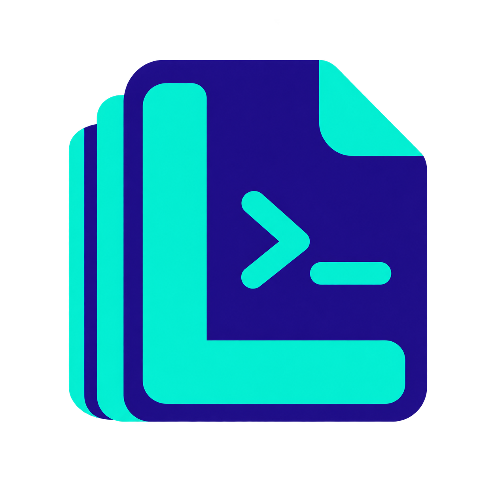

# Listless



**A portable file and directory viewer for Linux, Windows, and macOS.**

> **Project status: just beginning**

Listless is the modern continuation of the historic **OnScreen/2**.

Its primary purpose is to view files. When started without a file argument or redirected input, it acts as a directory viewer, allowing files to be selected and opened interactively.

Listless has a working Linux ncurses implementation. Windows and macOS
backends, along with advanced file-management workflows, remain porting work;
there is not yet a finished Listless release.

## Why Listless?

The name is a small Unix-style joke:

* `ls` lists files
* `less` views files
* **Listless** does both

The command name is:

```text
lss
```

## Screenshots

### Directory browser


### Syntax-highlighted viewer


### Hex viewer


## Goals

The aim is to preserve the behaviour and feel of OnScreen/2 while building a cleaner, safer, portable implementation.

Key principles are:

* Linux first, with Windows and macOS as permanent targets
* standard C++ wherever practical
* RAII and clear ownership
* STL containers and standard concurrency primitives
* thin platform-specific interfaces
* no scattered platform `#ifdef` logic
* preserve behaviour, but fix genuine bugs
* regression tests for bug fixes
* issue-driven, incremental development
* build, test, document, commit and push each clean iteration

The guiding rule is:

> **Every iteration should leave the project easier to understand than it was before.**

## Development

Work begins with understanding and documenting the existing OnScreen/2 implementation before making substantial changes.

Development will proceed subsystem by subsystem, using GitHub issues for traceability.

Each successful iteration should compile cleanly, pass tests and quality gates, update documentation where needed, append to `PORTING_JOURNEY.md`, and be committed and pushed independently.

## Documentation

`/docs` contains product-first Listless documentation. Start at
[docs/documentation.md](docs/documentation.md), or browse the published site at
<https://johnjoeallen.github.io/listless/>. Original-source research and
subsystem derivations live separately under [docs/porting](docs/porting/index.md),
alongside the append-only [`PORTING_JOURNEY.md`](PORTING_JOURNEY.md).

## Porting Journal

`PORTING_JOURNEY.md` records the engineering history of the project.

It is created once and then only appended to, recording the related issue, objectives, changes, decisions, bugs fixed, tests, behaviour notes, and next steps.

## Status

Listless is in active porting and refinement, with the Linux viewer and
read-only directory browser available for use.

Expect the architecture, build system, and repository structure to evolve as the original implementation is understood.

Historical OnScreen/2 behaviour remains the reference point, but the new project and product name is **Listless**.
