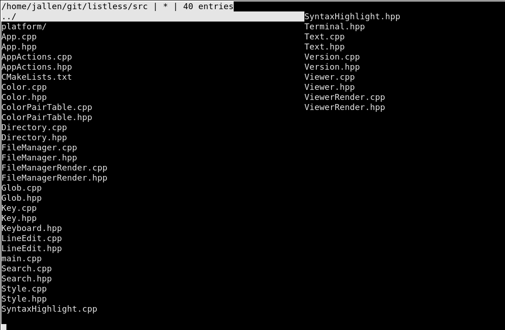
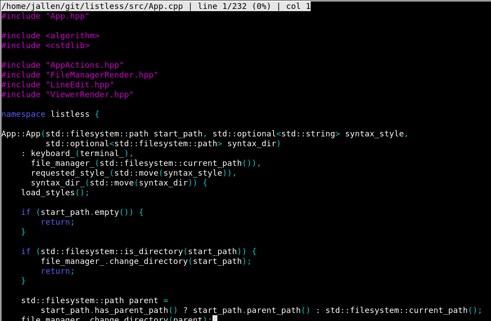
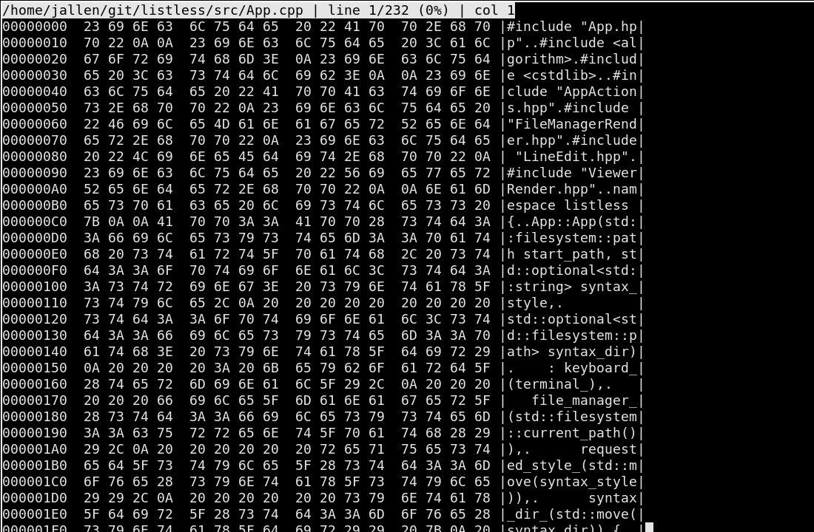

# Listless

Listless (`lss`) is a terminal file and directory viewer. It combines
directory browsing with a pager-style file viewer, text and hex views,
searching, and configurable syntax highlighting.

The current implementation runs on Linux. Windows and macOS are target
platforms whose backends are still to be completed.

[View on GitHub](https://github.com/johnjoeallen/listless){ .md-button .md-button--primary }
[Download latest release](https://github.com/johnjoeallen/listless/releases){ .md-button }

## Start here

- [Getting started](getting-started.md)
- [Using Listless](usage.md)
- [Syntax highlighting](syntax-highlighting.md)
- [Configuration](configuration.md)
- [Roadmap](roadmap.md)
- [Repository README](https://github.com/johnjoeallen/listless/blob/main/README.md)

## Screenshots

### Directory browser

### Syntax-highlighted viewer

### Hex viewer

## Project history

Listless is a modern port of [OnScreen/2](porting/original.md), targeting:

- :fontawesome-brands-linux: Linux
- :fontawesome-brands-windows: Windows
- :fontawesome-brands-apple: macOS

The Listless name is a nod to Vern Buerg's DOS `LIST` program. According to
the original author, OnScreen/2 was created because OS/2 lacked a comparable
LIST-style file viewer.

Product documentation is separate from the source research and engineering
record. See the [Porting record](porting/index.md) for the original-system
analysis, subsystem derivations, and append-only Porting Journey.

### OnScreen/2 references

- [OS2World OnScreen/2 source repository](https://github.com/OS2World/UTIL-FILEMANAGER-OnScreen2)
  — the preserved source code for the original OS/2 application.
- [Lost Archives OnScreen/2 file](https://www.lostarchives.org/category/30/file/6285)
  — an archived historical distribution of OnScreen/2.
- [OS2World OnScreen/2 wiki article](https://wiki.os2world.com/index.php?title=OnScreen/2)
  — background, usage, and historical information about the original tool.
